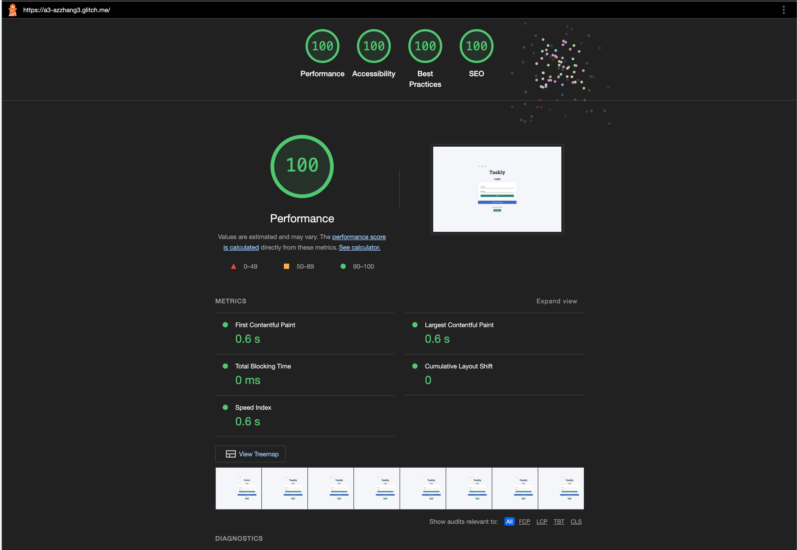
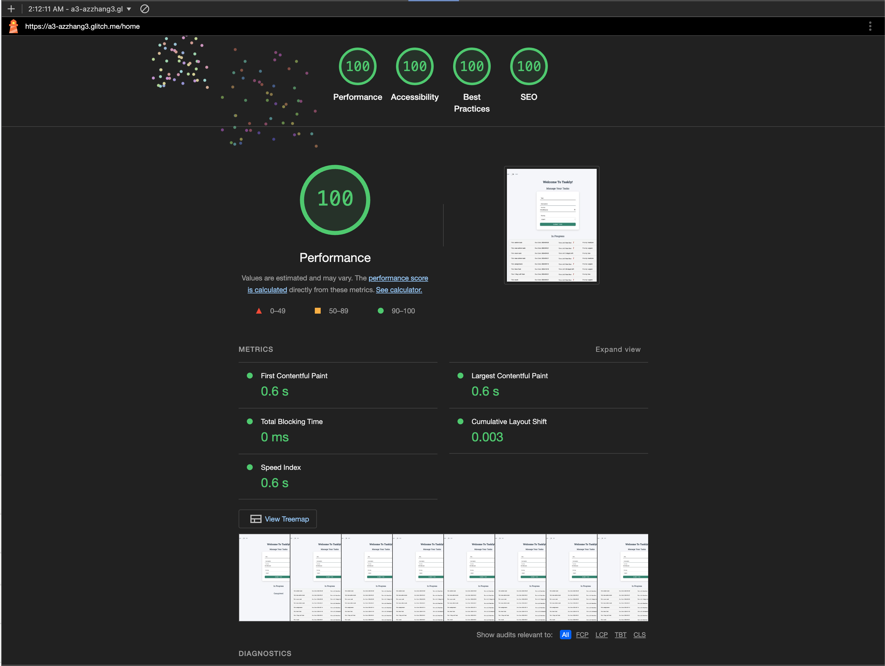
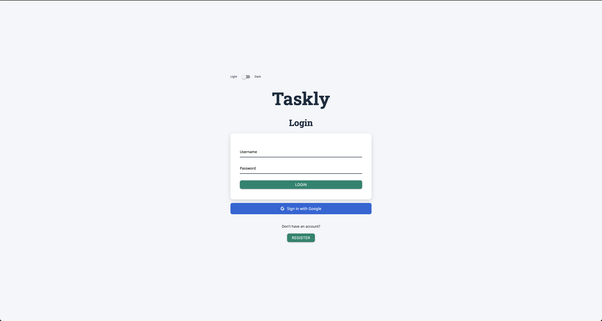
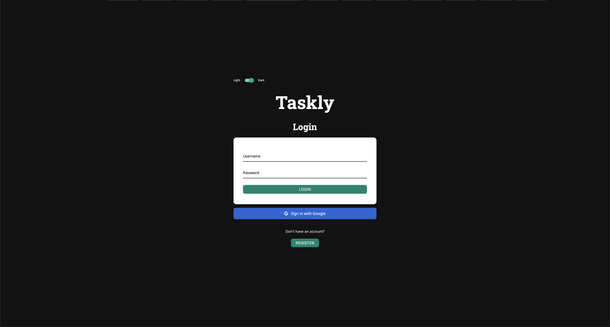
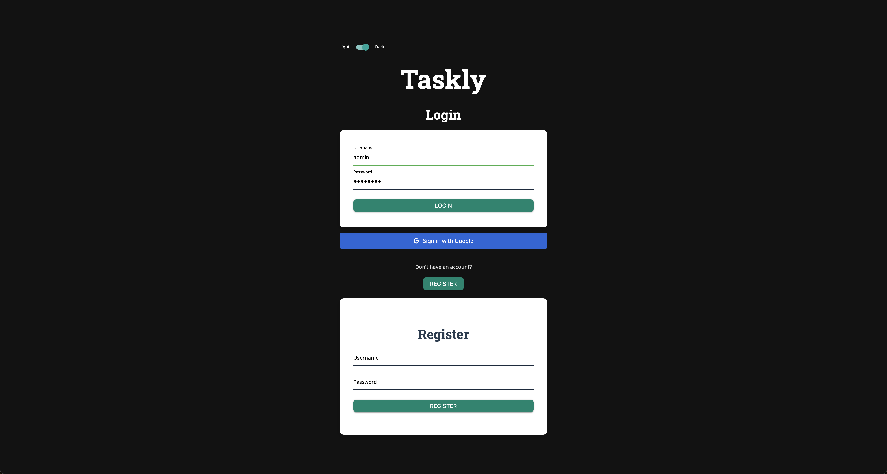
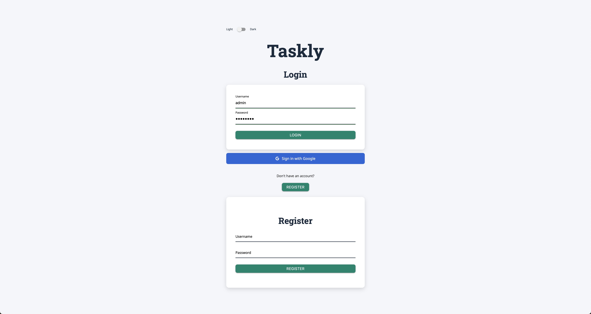
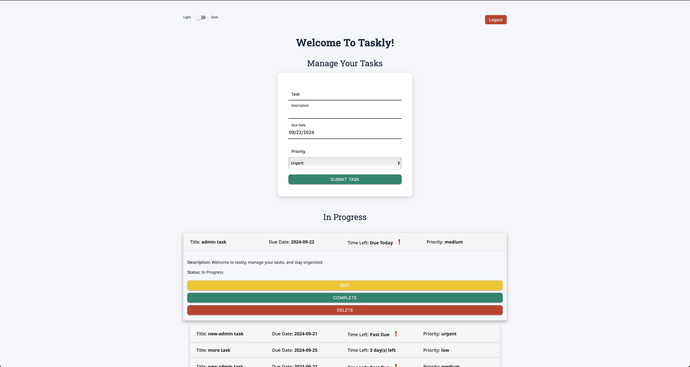
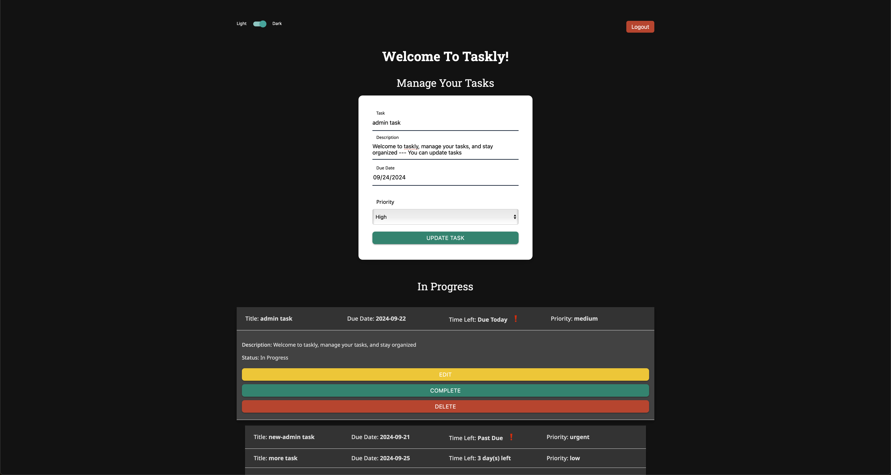
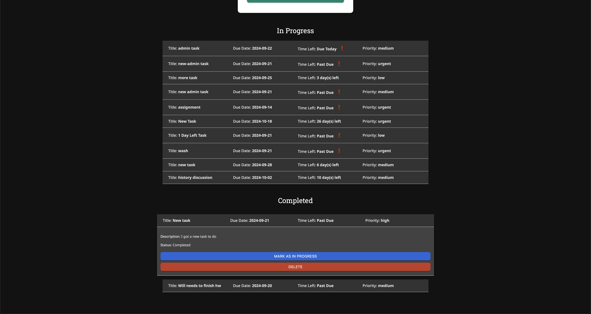
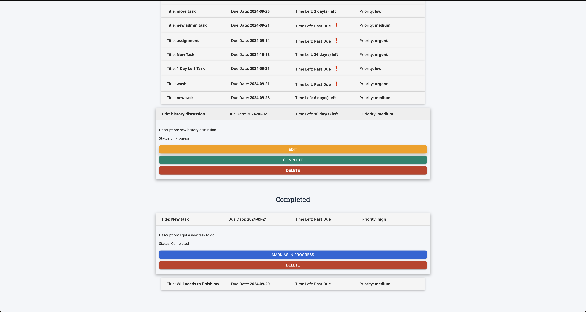

Assignment 3 - Persistence: Two-tier Web Application with Database, Express server, and CSS template
---

## Taskly

https://a3-azzhang3.glitch.me

### Goal
The goal of this application is to provide users with an efficient and intuitive platform for managing their tasks. Users can create, edit, prioritize, and track tasks based on their deadlines, allowing them to stay organized and focused. The application is designed to help users manage their workload by clearly showing upcoming deadlines, highlighting tasks that need attention, and providing a user-friendly interface for managing both ongoing and completed tasks. 

### Challenges
- Ensuring that tasks were correctly displayed
- Creating a layout that looks good and functions well, which required substantial work with both the CSS framework and custom styling adjustments.
- Implementing dynamic elements, such as the collapsible task for users to see descriptions. This also ensured that tasks would automatically resize and fit their content.
- Ensuring that tasks with urgent deadlines or those that were past due were visually emphasized without cluttering the interface.

### Authentication
For user authentication, there are two ways: Google Authentication and a default username and password. Google Auth was used because it provided a secure way to authenticate users, and allowed for integration with existing identity providers. Additionally, it simplified user registration and login process, making the app easier to use. The username and password was used because it provided a way for users to sign up and use the application without any third party requirements. Additionally, users may not feel comfortable connecting their account to the app, and a simple username and password allows them to still access the app. 

### CSS Framework
Materialize CSS was chosen as the CSS framework for this project. Materialize was chosen because it offers a modern, responsive design with pre-built components that helped accelerate development. The framework provided a clean, intuitive UI that fits well with the goal of creating a user-friendly task manager.

#### Custom CSS Modifications

While Materialize CSS provided a solid foundation, several custom modifications were made to enhance the design and functionality:

1. Dark Mode Toggle: A custom dark mode toggle was implemented using JavaScript and custom CSS. The dark mode switches the background color, text color, and other UI elements to provide a more comfortable viewing experience in low-light environments.
2. Task Header Adjustments: To improve the layout of the task headers, I used custom flexbox layouts which helps with consistent spacing between the task title, due date, priority, and status.
3. Urgency Indicators: Custom CSS for visual urgency indicators were added using red icons and color changes for tasks that were past due or had only one day remaining. This modification helped to prioritize tasks visually and improve the user experience.
5. Textarea Resizing: To solve a bug where the textarea size would remain enlarged after editing, I implemented a custom solution that ensures the textarea automatically resizes based on the content.

There were also other custom CSS styling which all help with the user experience, making everything simple and user-friendly.

## Technical Achievements
- **Tech Achievement 1**: Implemented the Google Authentication method as an alternative for users to sign-up and sign-in with. This was done through the passport library. The default registration and login method is using the user-name and password, but google authentication simplifies the process, if the user chooses to use it. 

- **Tech Achievement 2**: The website achieved 100% in all four lighthouse tests required for this assignment on both the login page and the home page.

## Design/Evaluation Achievements
- **Design Achievement 1 (5 Points?)**: Instead of using a traditional table to display tasks, the app uses a collapsible dropdown to organize the task list. The collapsible component allows tasks to be presented in a clean, minimalistic manner while still providing access to detailed information when needed. It provides a more streamlined and user-friendly interface, where only the most relevant information (such as the task title, due date, and priority) is displayed at first glance. Users can then expand individual tasks to view detailed information like descriptions and action buttons (edit, complete, delete), keeping the interface less cluttered. Additionally it keeps users focused on what’s important, and not overwhelmed with too much information at once.

- **Design Achievement 2 (5 Points?)**: Dark mode was integrated into the application to enhance both user experience and accessibility. By allowing users to toggle between light and dark themes, the application caters to different lighting environments and user preferences.  Dark mode provides a more comfortable viewing experience in low-light or nighttime environments. Bright screens can cause eye strain, especially during prolonged usage, and dark mode helps alleviate this by reducing the brightness and harshness of the UI. Additionally, for users with sensitivity to bright light, dark mode can significantly improve accessibility. It reduces the overall brightness of the screen, making the application more comfortable for individuals who struggle with bright interfaces.

## Pictures

