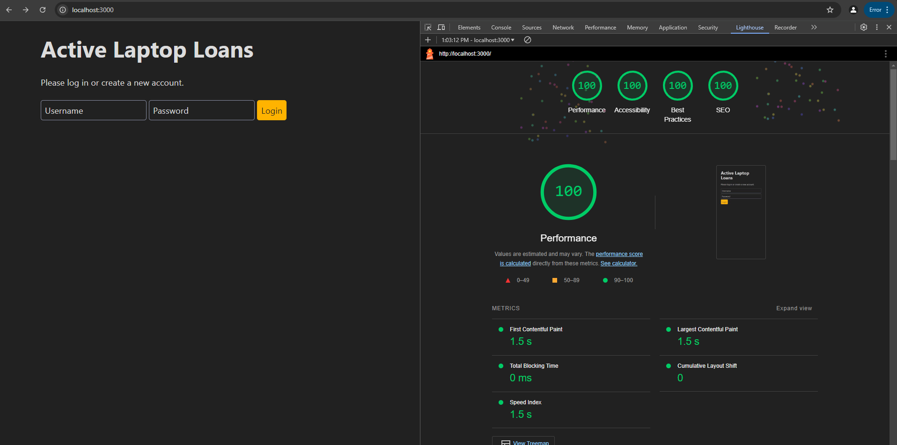
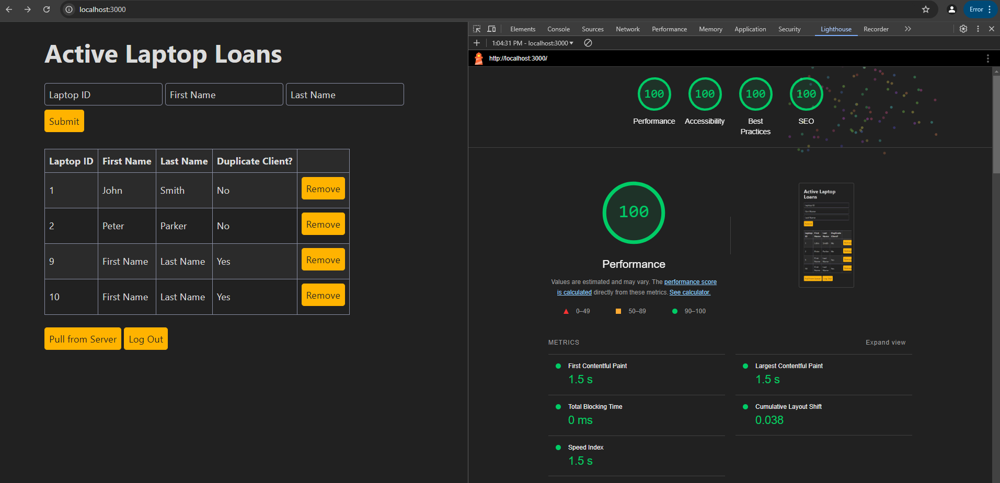

## Laptop Loan Tracker

Christian Rua http://a3-christianr839.glitch.me

This project is a simple form that allows an IT desk to keep track of laptops that are on loan. Users fill out a form indicating the ID number of the laptop and the name of the individual it's being loaned to and their information will be stored in a database and displayed in the table. There is also now a login system that allows users to have a personal list that is associated with only their account.

If a laptop ID is entered that is negative, the website will prompt the user to change it. If it is not an integer, the website will take the floor of that value. If the ID already exists within the table, the contents of that row will be updated to the new data. To remove an item, select the 'remove' button next to each entry.

If multiple clients are in use at the same time (logged into the same account), the user may select the "pull from server" button to retrieve any data that is stored on the server. Additionally, the table sorts itself and has an additional column to flag any people who appear more than once in the table (this is not case-sensitive).

I used Simple CSS as my CSS framework for this assignment because it is a very clean design with nice colors, both of which I feel compliment the purpose of this website.

## Technical Achievements

- **100% on Lighthouse**: I attended to all warnings / errors that appeared when I did my Lighthouse tests and received 100% in each category for both pages on my website. I don't know if it's different per page, but I did it twice anyways to be sure.

## Design/Evaluation Achievements

None
