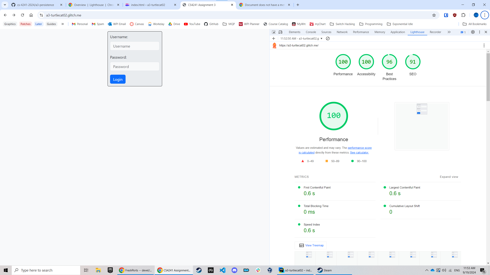

# Events

http://a3-turtlecat02.glitch.me

I created an application that stores events and automatically calculates the time you need to leave based on the travel duration.
Some challenges I faced was getting redirection to work properly and getting formatting to work with the Bootstrap library.
I used the normal login strategy because it was the easiest.
I used Bootstrap because I have used it a bit before, and I added some modifications to the login page so that it would look nicer and centered.

## Lighthouse Run

## Technical Achievements
- **Tech Achievement 1**: I used Mongoose with MongoDB to add validation to the database
- **Tech Achievement 2**: A middleware I used was cookie-session to add session data to the client to keep track of who was logged in.
