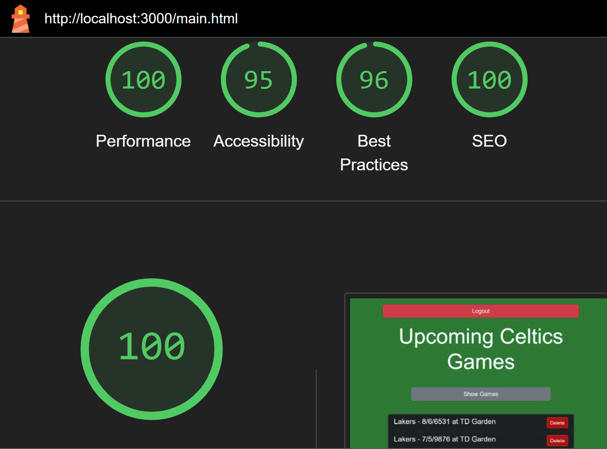

Assignment 3 - Persistence: Two-tier Web Application with Database, Express server, and CSS template
===

CSS:  
- CSS styling should primarily be provided by your chosen template/framework. 
Oftentimes a great deal of care has been put into designing CSS templates; 
don't override their stylesheets unless you are extremely confident in your graphic design capabilities. 
The idea is to use CSS templates that give you a professional looking design aesthetic without requiring you to be a graphic designer yourself.

JavaScript:  
- At minimum, a small amount of front-end JavaScript to get / fetch data from the server. 
See the [previous assignment](https://github.com/cs-4241-23/shortstack) for reference.

Node.js:  
- A server using Express and a persistent database (mongodb).

General:  
- Your site should achieve at least 90% on the `Performance`, `Best Practices`, `Accessibility`, and `SEO` tests 
using Google [Lighthouse](https://developers.google.com/web/tools/lighthouse) (don't worry about the PWA test, and don't worry about scores for mobile devices).
Test early and often so that fixing problems doesn't lead to suffering at the end of the assignment. 

Deliverables
---

6. Create and submit a Pull Request to the original repo. Name the pull request using the following template: `a3-firstname-lastname`.

---

## Your Web Application Title

[Heroku link](https://trajan-espelien-webware-a3-589e3ae8565b.herokuapp.com)

I built a simple bookmark manager that allows users to add and remove bookmarks: title and URL. The CSS is done entirely using Bulma which saved me considerable time. It provides a clean and simple interface with interesting colors which I liked.
Challenges included the routing logic and deleting bookmarks from the database based off their URL. I also ran into challenges with URLs that contained fragments like #xyz, which I solved by simplying ignoring anything after a # symbol.
I used a simple login with encrypted passwords because Github login felt too niche for a product with such a wide variety of possible users, not all of which have Github.

## Technical Achievements
- **Tech Achievement 1**: I deployed the application to Heroku, which was only a bit harder than Glitch. I had to find the settings page that allowed me to set configuration variables, equivalent to the .env file. Besides that it was a relatively simple process to deploy straight from this repo's main branch.
- **TA 2**: I used a few new Express middlewares. `cors` allows cross origin requests which resolved some errors stemming from the server not initially trusting the localhost IP address I tested on. `session` helped me keep track of the user's session between the login and bookmark pages, which displays the username in the title. `bcryptjs` is a simple library that I used to hash the passwords before storing in the database.

### Design/Evaluation Achievements
- **Design Achievement 1**: I followed the following tips from the W3C Web Accessibility Initiative...
