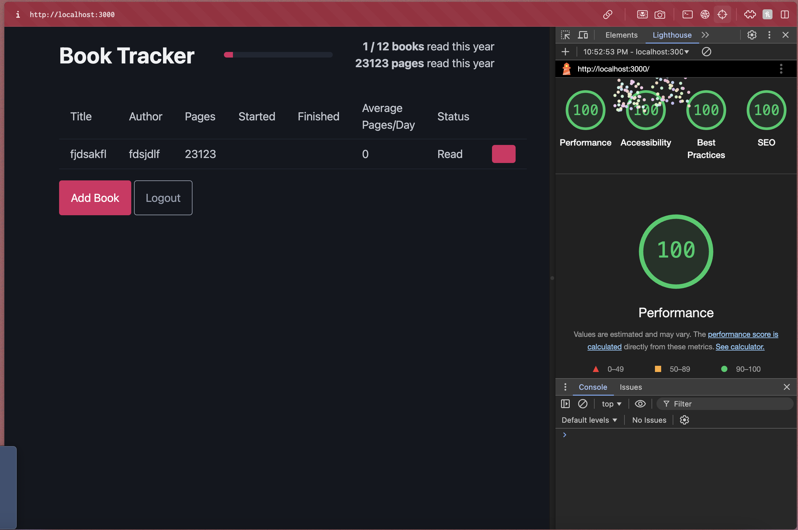

Assignment 3 - Persistence: Two-tier Web Application with Database, Express server, and CSS template
===

Due: September 19th, by 11:59 AM.

This assignnment continues where we left off, extending it to use the most popular Node.js server framework (express), 
a database (mongodb), and a CSS application framework / template of your choice (Boostrap, Material Design, Semantic UI, Pure etc.)

Baseline Requirements
---

Your application is required to implement the following functionalities:

- a `Server`, created using Express (no alternatives will be accepted for this assignment)
- a `Results` functionality which shows all data associated with a logged in user (except passwords)
- a `Form/Entry` functionality which allows users to add, modify, and delete data items (must be all three!) associated with their user name / account. 
- Persistent data storage in between server sessions using [mongodb](https://www.mongodb.com/cloud/atlas) (you *must* use mongodb for this assignment). You can use either the [official mongodb node.js library](https://www.npmjs.com/package/mongodb) or use the [Mongoose library](https://www.npmjs.com/package/mongoose), which enables you to define formal schemas for your database. Please be aware that the course staff cannot provide in-depth support for use of Mongoose.  
- Use of a [CSS framework or template](https://github.com/troxler/awesome-css-frameworks). 
This should do the bulk of your styling/CSS for you and be appropriate to your application. 
For example, don't use [NES.css](https://nostalgic-css.github.io/NES.css/) (which is awesome!) unless you're creating a game or some type of retro 80s site.

Your application is required to demonstrate the use of the following concepts:  

HTML:  
- HTML input tags and form fields of various flavors (`<textarea>`, `<input>`, checkboxes, radio buttons etc.)
- HTML that can display all data *for a particular authenticated user*. Note that this is different from the last assignnment, which required the display of all data in memory on the server.

Note that it might make sense to have two pages for this assignment, one that handles login / authentication, and one that contains the rest of your application.
For example, when visiting the home page for the assignment, users could be presented with a login form. After submitting the login form, if the login is 
successful, they are taken to the main application. If they fail, they are sent back to the login to try again. For this assignment, it is acceptable to simply create 
new user accounts upon login if none exist, however, you must alert your users to this fact.  

CSS:  
- CSS styling should primarily be provided by your chosen template/framework. 
Oftentimes a great deal of care has been put into designing CSS templates; 
don't override their stylesheets unless you are extremely confident in your graphic design capabilities. 
The idea is to use CSS templates that give you a professional looking design aesthetic without requiring you to be a graphic designer yourself.

JavaScript:  
- At minimum, a small amount of front-end JavaScript to get / fetch data from the server. 
See the [previous assignment](https://github.com/cs-4241-23/shortstack) for reference.

Node.js:  
- A server using Express and a persistent database (mongodb).

General:  
- Your site should achieve at least 90% on the `Performance`, `Best Practices`, `Accessibility`, and `SEO` tests 
using Google [Lighthouse](https://developers.google.com/web/tools/lighthouse) (don't worry about the PWA test, and don't worry about scores for mobile devices).
Test early and often so that fixing problems doesn't lead to suffering at the end of the assignment. 

Deliverables
---

Do the following to complete this assignment:

1. Implement your project with the above requirements. I'd begin by converting your A2 assignment. First, change the server to use express. Then, modify the server to use mongodb instead of storing data locally. Last but not least, implement user accounts and login. User accounts and login is often the hardest part of this assignment, so budget your time accordingly.
2. If you developed your project locally, deploy your project to Glitch (unless completing the alternative server technical acheivement described below), and fill in the appropriate fields in your package.json file.
3. Test your project to make sure that when someone goes to your main page on Glitch (or an alternative server), it displays correctly.
4. Ensure that your project has the proper naming scheme `a3-yourfirstname-yourlastname` so we can find it.
5. Fork this repository and modify the README to the specifications below.
6. Create and submit a Pull Request to the original repo. Name the pull request using the following template: `a3-firstname-lastname`.

Acheivements
---

Below are suggested technical and design achievements. You can use these to help boost your grade up to an A and customize the 
assignment to your personal interests, for a maximum twenty additional points and a maximum grade of a 100%. 
These are recommended acheivements, but feel free to create/implement your own... just make sure you thoroughly describe what you did in your README, 
why it was challenging, and how many points you think the achievement should be worth. 
ALL ACHIEVEMENTS MUST BE DESCRIBED IN YOUR README IN ORDER TO GET CREDIT FOR THEM.

*Technical*
- (10 points) Implement OAuth authentication, perhaps with a library like [passport.js](http://www.passportjs.org/). 
*You must either use Github authenticaion or provide a username/password to access a dummy account*. 
Course staff cannot be expected, for example, to have a personal Facebook, Google, or Twitter account to use when grading this assignment. 
Please contact the course staff if you have any questions about this. THIS IS THE HARDEST ACHEIVEMENT OFFERED IN WEBWARE. You have been warned!  
- (5 points) Instead of Glitch, host your site on a different service like [Heroku](https://www.heroku.com) or [Digital Ocean](https://www.digitalocean.com). Make sure to describe this a bit in your README. What was better about using the service you chose as compared to Glitch? What (if anything) was worse? 
- (5 points) Get 100% (not 98%, not 99%, but 100%) in all four lighthouse tests required for this assignment.  

*Design/UX*
- (10 points) Make your site accessible using the [resources and hints available from the W3C](https://www.w3.org/WAI/), Implement/follow twelve tips from their [tips for writing](https://www.w3.org/WAI/tips/writing/), [tips for designing](https://www.w3.org/WAI/tips/designing/), and [tips for development](https://www.w3.org/WAI/tips/developing/). *Note that all twelve must require active work on your part*. 
For example, even though your page will most likely not have a captcha, you don't get this as one of your twelve tips to follow because you're effectively 
getting it "for free" without having to actively change anything about your site. 
Contact the course staff if you have any questions about what qualifies and doesn't qualify in this regard. 
List each tip that you followed and describe what you did to follow it in your site.
- (5 points) Describe how your site uses the CRAP principles in the Non-Designer's Design Book readings. 
Which element received the most emphasis (contrast) on each page? 
How did you use proximity to organize the visual information on your page? 
What design elements (colors, fonts, layouts, etc.) did you use repeatedly throughout your site? 
How did you use alignment to organize information and/or increase contrast for particular elements. 
Write a paragraph of at least 125 words *for each of four principles* (four paragraphs, 500 words in total). 

Sample Readme (delete the above when you're ready to submit, and modify the below so with your links and descriptions)
---

## Book Tracker

your glitch (or alternative server) link e.g. http://a3-charlie-roberts.glitch.me

My project allows you to track books that you've read, are reading or are going to read. Books that you have read count towards the set reading goal and changing the status of books will autofill start/end date information if you don't specify any.

Working with a pre-made CSS framework saved time, but it was difficult to style the individual elements in the layout that I wanted on top of the framework styles. I also struggled with OAuth authentication like when applying middleware that checks for authentication, and integrating with Github. It got a little overwhelming on the backend with all the different roots.

I chose to use OAuth authentication via Github and Passport.js. Using Github seemed like the easier choice since Github provides an authentication page and user information that can be used for querying the database.

I chose PicoCSS because it seemed clean and easy to use while providing all the functionality I wanted. It also let me choose a single theme color to use across all the primary elements. I only had to write a couple CSS rules to change the layout and spacing of elements on the page.

## Technical Achievements
- **OAuth Authentication**: I used OAuth authentication via the GitHub strategy to authenticate users. The Github user ID is used when querying the database so that only the user's data is retrieved. Users are redirected to my login/landing page when not authenticated, and will remain login via express session cookies.
- **Vercel Hosting**:
- **100% Lighthouse Score**:
