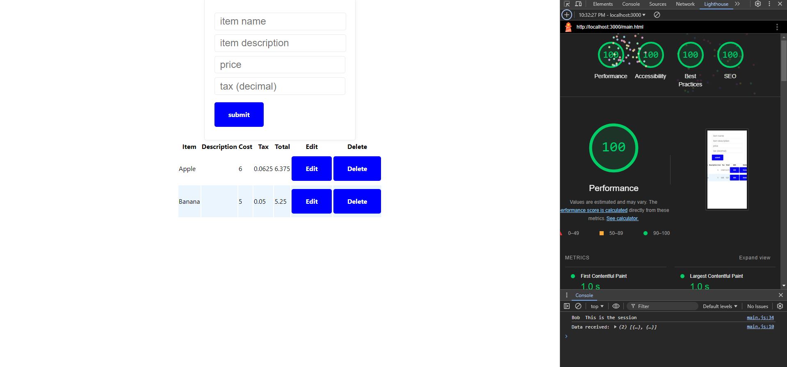

--## a3-joeyc5565
Name: Joseph Caproni
Glitch Link: https://a4joeyc5565.glitch.me/
Include a very brief summary of your project here. Be sure to include the CSS positioning technique you used, and any required instructions to use your application.

App lets you add grocery items to a list. It calculates the total cost of each one based upon the sales tax inputed. To add an item press submit. To edit an item, press the edit button on the item you wish to modify, and change the fields in the top box. Press submit to apply the changes to the table. To delete an item press the delete button next to the respective item.

Used the mvp.css layout. I modified the color scheme and minified it to pass the lighthouse test with 100% on everything.

I encountered challenges getting the data to edit by prepopulating my form and then submitting it to edit an existing entry.

I used the cookie-session to authenticate the login and referenced the user in that cookie to ensure that the data in the table that they saw was relevant only to them.

## Technical Achievements
**Tech Achievement 1**: Using a combination of...
Form updates submitted data to a table from the server.
Form has the ability to edit and modify existing items.
### Design/Evaluation Achievements
**Design Achievement 1**: 
Used
---

## Your Web Application Title

your glitch (or alternative server) link e.g. http://a3-charlie-roberts.glitch.me

Include a very brief summary of your project here. Images are encouraged, along with concise, high-level text. Be sure to include:

- the goal of the application
- challenges you faced in realizing the application
- what authentication strategy you chose to use and why (choosing one because it seemed the easiest to implement is perfectly acceptable)
- what CSS framework you used and why
  - include any modifications to the CSS framework you made via custom CSS you authored
- the five Express middleware packages you used and a short (one sentence) summary of what each one does. If you use a custom function for *one* (and one alone) middleware please 
add a little more detail about what it does.

## Technical Achievements
- **Tech Achievement 3**: I got 100% on all four lighthouse tests

- **Tech Achievement 4**: The dotenv middleware package loads environment variables from the .env file in process.env. Holds database login info.
The express middleware provides the framework for the express server. The server type hosting this app is express.
The cookie-session middleware uses cookies to store user session data.
The path middleware provides utilities for working with the directory paths.
The compression middleware compresses the bodies for requests that go through it. Reduces the size of the response body.
The MongodDB middleware is the driver for MongoDB. This is the database used to store the information within the application.