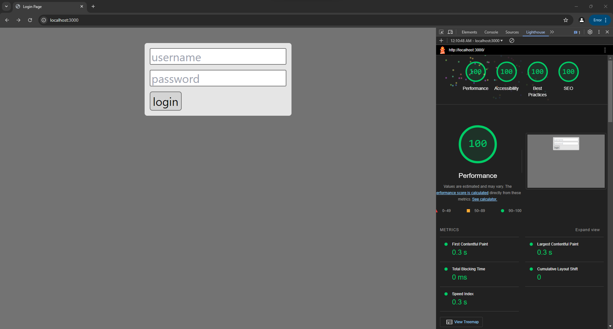
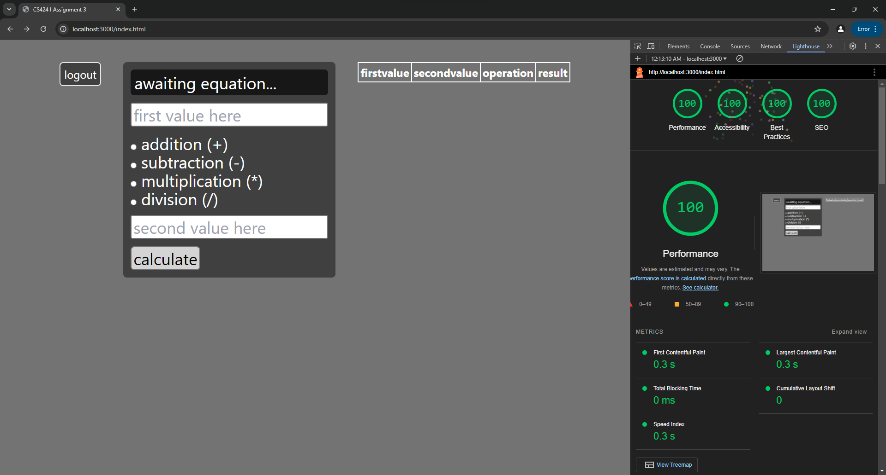

## Basic Arithmetic Calculator

https://a3-henryhribar.glitch.me/

- The goal of this application is to create a basic arithmetic calculator that saves the history of the user's equations performed.
- I had the most challenges configuring the server code to work properly.
- I used a collection in my database to store logins and cookies to keep track which user is currently logged in.
- I used tailwindCSS as my CSS framework because I was more familiar with it since I have used it before.

## Technical Achievements
- **Tech Achievement 1**: I got 100% in all four lighthouse tests for both the login page and the main page.

