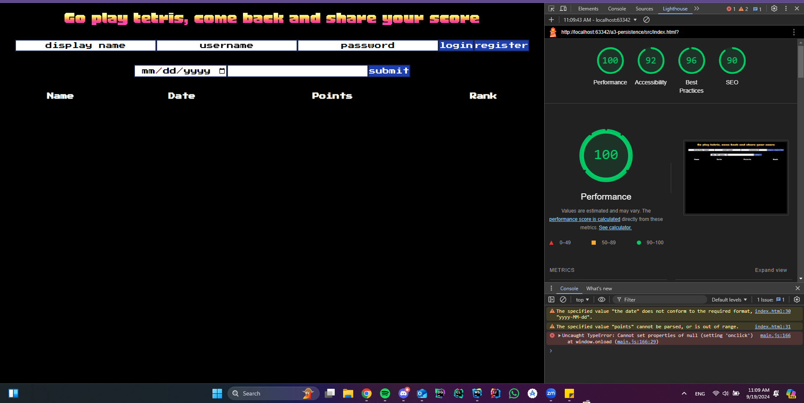

Assignment 3 - Persistence: Two-tier Web Application with Database, Express server, and CSS template
===

## Score Tracker

My glitch link e.g. http://a3-charlie-roberts.glitch.me

Include a very brief summary of your project here. Images are encouraged, along with concise, high-level text. Be sure to include:
My project is a website that allows you to track your scores from playing tetris. 
I faced a lot of issues with sorting out my model client-side and on the database side.
I chose to implement my own authentication, which checks if the username exists and compares the password. I figured it would be easier than setting up an existing one. 
I used tailwindcss, and loaded my custom fonts on it. I then added tailwind styling into my html file.

Note: My Lighthouse was a bit off at times, but there were instances of it reaching 100. My performance is AROUND 90, but I think it might be a bit slow at times due to the use of two different fonts.

