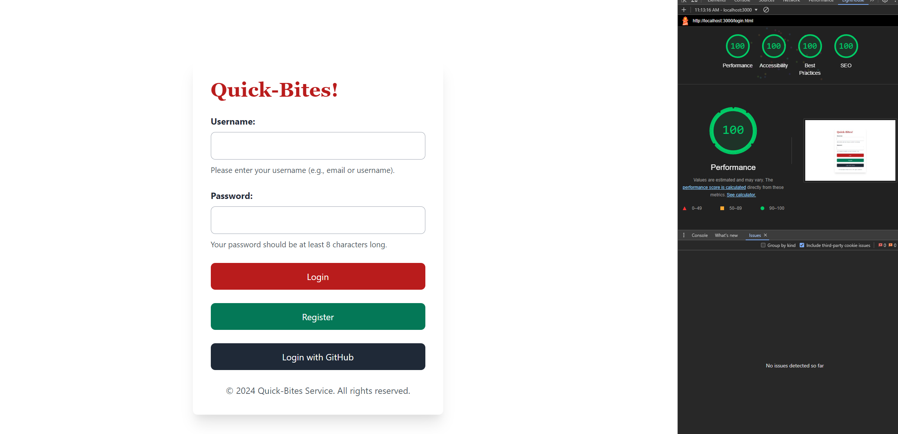
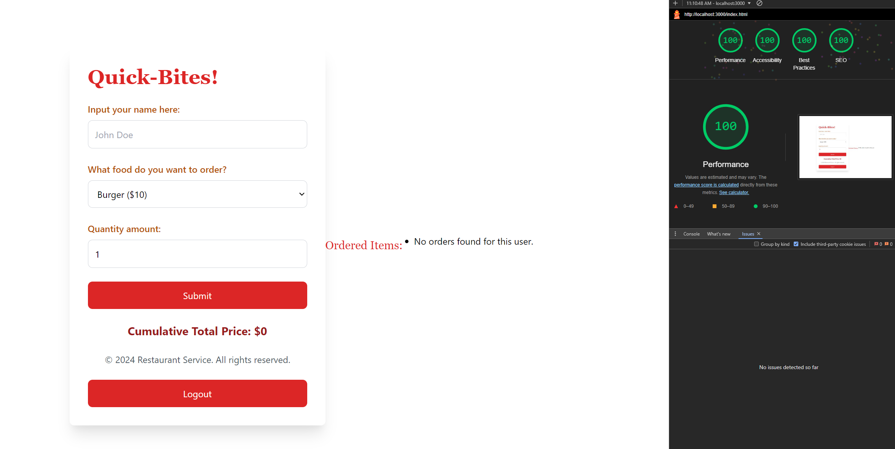

## Quick-Bites Food Service!

## Description

The goal of this application is to send food orders in the Quick Bite Food Service, detailing your name, food order, and the food quantity. The following inputs will net a cumulative total price for all orders. All the orders are unique, based on the user logged in.
The main challenge that I faced while creating this application is definitely manipulating the MongoDB database and its data, via using the fetch functions that can add, edit, and delete food orders. It was a tough learning curve! 
I used both the traditional login and also OAuth (passport for GitHub). This allows more variety in ways of logging into the application but also I really wanted to learn how to use OAuth. The cookie-parser definitely helped with my authentication on both methods.
I used the Tailwind framework because I am much more familiar with the framework in comparison to the others. I have used it before in my Software Engineering class, but also my Internship.

Here are the middlewares I have used for this application:
1. **body-parser**: The middleware parses the incoming JSON request bodies, making it accessible via req.body.
2. **cors**: This middleware enables Cross-Origin Resource Sharing (CORS), allowing requests from other domains.
3. **express.static**: Serves static files from the public directory.
4. **Helmet**: Provides more security by setting various HTTP headers.
5. **morgan**: Logs HTTP requests in the terminal, using the 'tiny' format.
6. **cookie-parser**: Parses the cookies attached on the client side, allowing easy access to cookie values.
7. **express-session**: Helps manage user sessions, storing the session data on the server using cookies.
8. **passport.initialize()**: Initializes Passport for user authentication
9. **passport.session()**: Implements Passport with session management which allows the users to be authenticated across multiple requests
10. **passportAuthenticated**: A custom middleware. Checks if the user is authenticated via Passport or a session cookie. If authenticated, grant the user access to the protected routes. If not, then keeps the user from entering the main page without access.  

## Lighthouse Tests
- **Login Page**: 
- **Main Page**: 

## Technical Achievements
- **OAuth for GitHub**: Implemented OAuth for GitHub users. Set authentication for both cookies and passport (traditional Logjn and OAuth Login)
- **Unique Data for each particular user**: Each user logged in has unique data that is created by the authenticated user. 
- **Added log out button**: Added a logout button that clears the cookies cached by the user and restricts the user from reentering without logging in again.
- **Hosted on a different site**: I used Vercel as another hosting site for the application other than glitch. I was able to quickly deploy my project and use my GitHub to display all my repositories needed for A3. However, the main issue is not being able to use my MongoDB database for some reason.
- **HTML Forms**: I have used the correct HTML form inputs to gather data from the user, which includes their login credentials and their food orders. The data inputted is then captured using res and req with body to send the data into the server.
- **MongoDB and Express Middleware**: I have incorporated the MongoDB and Express Middleware to house the data provided by the user, which includes their login credentials and their food orders.
- **Add/Edit/Delete**: I have given the ability to add,edit and delete their data from the database which is also reflected in the MongoDB database. I have added these functions in the Server.js file.
- **Different Middlewares used**: I have incorporated other Middlewares to enhance runtime and help with security. These middlewares are: Cors, Body-parser, Helmet, Morgan, Cookie-parser, Express-static and more. Check the Middleware section in my Server.js file.
- **Persistent Data**: My data displayed on the application is reflective on the MongoDB database. The data can be modified and is still reflective on the database, whether you add, edit, or delete the data.
- **Server requests using Fetch**: I made all of my functions in Main.js using fetch to use server requests, which includes the function to fetch all initial orders from a particular user, functions working with the data for each other, adding food orders, and also for logging/registering a user into the application.
- **Lighthouse Test**: I have achieved 100% for all the lighthouse tests on this assignment. Look at the pictures above.

## Design/Evaluation Achievements
- **W3C Accessibility**: I followed the following tips from the W3C Web Accessibility Initiative:
  - Provide Clear and Simple Language (Writing): Added more descriptive placeholder texts (instructions) for the login page such as "Enter your username (e.g email or username)" for better understanding and reduces cognitive load.
  - Use Labels and Instructions for Form Inputs (Designing): I made sure that all input fields are using label elements and the aria-label attribute to provide additional information for screen readers. The labels help users with accessibility, especially for those relying on screen readers
  - Provide Visible Focus States for Interactive Elements (Designing): I added focus styles for all interactive elements such as the form files, buttons, and any links provided using Tailwind. I used the focus class as seen in those elements for both login.html/index.html. This makes it easier for users to navigate the form by highlighting focused elements.
  - Use Meaningful and Descriptive Page Titles (Writing): I have my title tags in both HTML files provide context as to what that page is meant to do. The title tag for Login is "Login to Quick-Bites Food Service" and for the Main page, it is "Quick-Bites Food Ordering System". The descriptive titles help users (especially those using assistive technologies) know the function of the page they are on.
  - Use Semantic HTML and ARIA Roles (Developing): I wrapped the main form content inside <main> element and added the aria-labelledby to all forms and interactive content. This helps improve screen reader navigation and provides a more structured form to the contents on the page.
  - Provide Helper Text with Form Inputs (Designing): I added helper texts below input fields like username and password to explain input expectations as "Please enter the password for your username here". This helps users avoid input errors and gives them more clarity as to what they should input in those fields.
  - Use Descriptive Link Text (Writing): Added a Link text to the Login.html for forgetting passwords (Note: there is no functionality) and made it descriptive. It reads "Forgot your password? Recover it here!". This helps users, especially screen readers, to know where the link is taking them.
  - Ensure Sufficient Color Contrast (Designing): Made the text color and background color closely meet the WCAG's contrast ratio guidelines. The contrast on both pages passed the Lighthouse Test. Ensuring sufficient contrast between the text and background improves the readability for users with visual impairments.
  - Enable Keyboard Navigation (Developing): I made sure that all form elements are focusable via the keyboard and added a clear focus state for the inputs. This is available in both Index.html and Login.html, just by pressing the Tab key. This is essential for users with motor disabilities that might rely on the keyboard instead of a mouse.
  - Group Related Elements Together (Designing): I grouped all related form elements (labels, inputs, and helper texts) using the 
 component and added aria-describedby attributes to link the inputs with their helper texts. This allows better context for screen readers and users relying on assistive technologies.
  - Responsive and Mobile-Friendly Design (Developing): I adjusted the viewport settings to make sure that the forms are responsive and optimized for mobile devices using <meta name="viewport"> tag in both html files. This allows the website to be more accessible and usable on a variety of devices, including smartphones and tablets.
  - Avoid Using Only Color to Convey Information (Designing): I made sure that the critical information (form errors and required fields) is not only conveyed by color alone. I added both bold text and helper text to indicate required fields. If we only use color, it might be problematic for users with color blindness or low vision. Adding textual information provides a healthy alternative.
- **CSS Framework**: I have implemented Tailwind as my main CSS Framework, which is used in both login.html and index.html. Look at the top of the html files for the stylesheet.
- **CRAP Principles**: I added a PDF detailing the CRAP principles and its usage for both Login.html and Index.html.

### Websites
- **Glitch**: https://standing-tarry-lunge.glitch.me
- **Vercel**: a3-nexus-18.vercel.app (put this in your browser, the deployment doesn't work with the login)