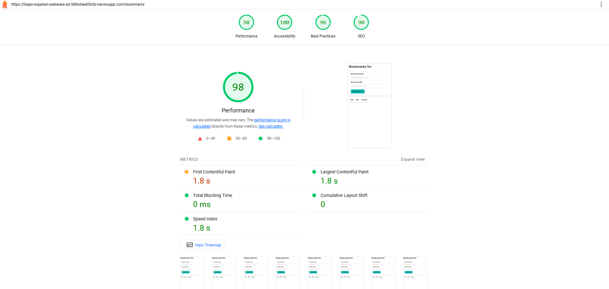

Assignment 3 - Persistence: Two-tier Web Application with Database, Express server, and CSS template
===

## Your Web Application Title

[Heroku link](https://trajan-espelien-webware-a3-589e3ae8565b.herokuapp.com)

I built a simple bookmark manager that allows users to add and remove bookmarks: title and URL. The CSS is done entirely using Bulma which saved me considerable time. It provides a clean and simple interface with interesting colors which I liked.
Challenges included the routing logic and deleting bookmarks from the database based off their URL. I also ran into challenges with URLs that contained fragments like #xyz, which I solved by simplying ignoring anything after a # symbol.
I used a simple login with encrypted passwords because Github login felt too niche for a product with such a wide variety of possible users, not all of which have Github.

## Technical Achievements
- **Tech Achievement 1**: I deployed the application to Heroku, which was only a bit harder than Glitch. I had to find the settings page that allowed me to set configuration variables, equivalent to the .env file. Besides that it was a relatively simple process to deploy straight from this repo's main branch.
- **TA 2**: I used a few new Express middlewares. `cors` allows cross origin requests which resolved some errors stemming from the server not initially trusting the localhost IP address I tested on. `session` helped me keep track of the user's session between the login and bookmark pages, which displays the username in the title. `bcryptjs` is a simple library that I used to hash the passwords before storing in the database.